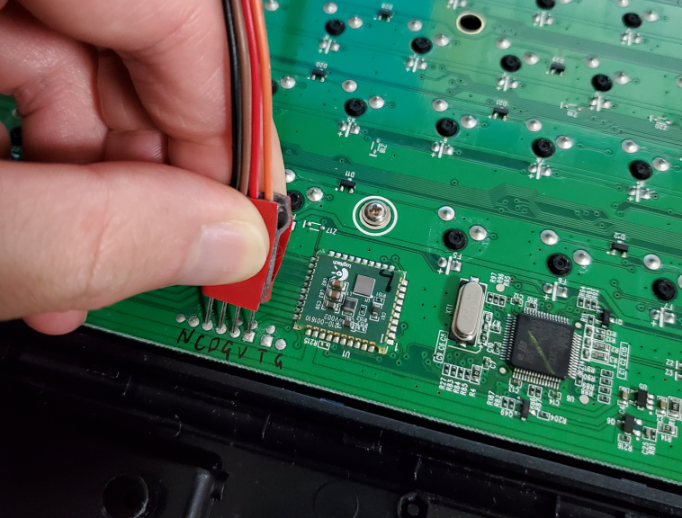

English / [简体中文](./README.md)

## Logitech G610 gaming keyboard firmware

## INTO:

This is a non-original firmware of Logitech G610 mechanical keyboard.

You'll need to disassemble the keyboard and flash the bootloader with a ST-Link for the first time.

Warning: flashing a non-original firmware may broken your keyboard, be careful.

## Feature:

1.Configs (brightness) save to eeprom (delay 5 seconds).

2.Game mode will turn off the two LED of the GUI key.

3.Menu(Application) key turn into be a "FN" key now.

4.Switchable Insert key, by pressing FN + Insert, combination key like Ctrl + Insert are not affected.

5.DFU upgrade mode, by pressing FN + Game Mode.

6.Back to the official firmware by FN + F1.

7.Holding GameMode when plug in the usb cable, will go into DFU mode.

8.Holding backlight when plug in the usb cable, will run the official firmware.

9.Smearing light effect switch by FN + Light.

10.NumLock guard, 'don't touch my NumLock', switch by FN + NumLock.

## flash mapping

## Note:

Use ./Src/usbd_hid.c and ./Inc/usbd_hid.h instead of the pair in ./Middlewares/ST/STM32_USB_Device_Library/Class/HID

coz every time the cubemx regenerate code they will be overwrite, so I move them out from the lib;

And don't forget to remove ./Middlewares/ST/STM32_USB_Device_Library/Class/HID/Src/usbd_hid.c from MDK source list

Bootloader:

https://github.com/lingex/STM32L_DFU_Solution/tree/Branch_128k

## Important:
This branch is a non-standard use of STM32L100R8, by using the 64k~128k internal flash, to keep both official firmware and our firmware
inside, can not download into device directly using MDK, and no debug, st-link utility and dfu are feasible.

## Flash steps

(You will need to install 2 software (not include the IDE):  STM32 ST-LINK Utility  and  ST DfuSe Demo)

I did some modify on the DfuSe Demo, see here: https://github.com/lingex/ST-DFUSe/releases

a.flash bootloader

  STM32 ST-LINK Utility : Bootloader.hex     (need a debug tool like ST-Link)
  
  this are the SWD pins
  
  
  
  
  
b.flash official fw

  STM32 ST-LINK Utility : Official_no_tail.hex   (need a debug tool like ST-Link)
  
  or ST DfuSe Demo ：Official_app_only.dfu

c.flash this fw
  
  STM32 ST-LINK Utility : G610Rebuild.hex   (need a debug tool like ST-Link)
  
  or ST DfuSe Demo : G610Rebuild.dfu

DFU Tool
https://github.com/lingex/ST-DFUSe/releases

  
## Flash back to official firmware (will also remove the bootloader):

  STM32 ST-LINK Utility : Official_bootloader_and_app.bin  (offset: 0x8000000)

## knowing issues

 - The volume roller is not good enough compare to the official version, expecrially in low speed.

 - NKRO required another endpoint, but can not send message through it, it may be soulved by using multi interfaces.

 - NKRO may not work on some linux OS: https://static.wongcornall.com/ibm-capsense-usb-web/ibm-capsense-usb.html#x1-140003.3

## Thanks to:

 - media keys
 
 https://github.com/diabolo38/HidKbd.git

 - ztask
 
 https://github.com/tomzbj/ztask

 - hex2dfu
 
https://github.com/nanoframework/hex2dfu
